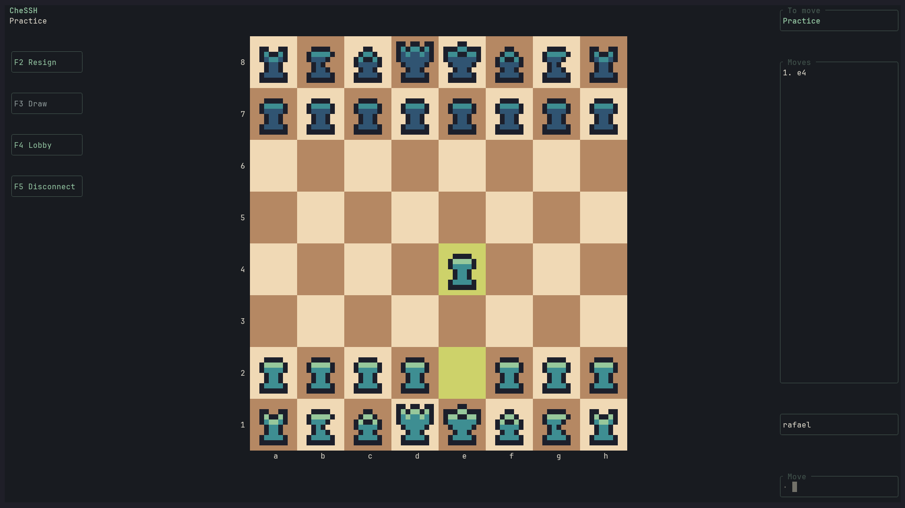

# CheSSH

Try it now from your terminal:

```bash
ssh -p 2222 chess.rafaelcl.com
```

CheSSH is a multiplayer chess game played entirely over SSH, with a pixel-art
board right in your terminal. All you need is an SSH client — no signup or game
installation required.

Once connected, type `/play` and press **Enter** to find an opponent, or `/solo`
to explore the board and play both sides yourself.



*Solo practice shown above. In solo mode, you control both sides.*

## Features

- Connect via SSH and play chess against other players
- Real-time multiplayer with matchmaking
- Beautiful terminal UI with pixel art-inspired colors
- Legal move validation via shakmaty

## Building

```bash
cargo build --release
```

## Running

```bash
cargo run
```

The server listens on port 2222 by default. Connect with:

```bash
ssh -p 2222 localhost
```

For a local-only listener, run `CHESSH_BIND_ADDR=127.0.0.1:2222 cargo run`.

## Deployment

See [deployment instructions](docs/deployment.md) for the systemd service,
persistent data, Cloudflare DNS and release checks.

## Server identity

The server creates an Ed25519 key in `host_key` on its first run and reuses it on
subsequent starts. On Unix it is created with permissions `0600`. Set
`CHESSH_HOST_KEY` to use a different path (its parent directory must exist).
Keep this file across restarts and deployments so SSH clients recognize the server.
An invalid or unreadable existing key stops startup instead of silently replacing
its identity.

## Game history

Multiplayer games are saved to `game_history.jsonl` when they finish, including
player names, result (`1-0`, `0-1`, `1/2-1/2`), termination reason, SAN moves,
final FEN and a Unix timestamp. `/solo` is a local practice board and is not archived.
Set `CHESSH_HISTORY_PATH` to choose another file; its parent directory must exist.

The history is loaded at startup and game IDs continue from the highest saved ID.
Only one server can write a history file at a time. Completed records are synced
to disk; an incomplete final append is recovered on startup, while corrupt complete
records produce an error. Write failures are logged and retained in memory for retry
on the next completed game or graceful shutdown. SIGINT/SIGTERM archives active
games with result `*` and reason `Server shutdown`.

## Playing

Navigate the lobby with **j/k**, **Up/Down**, or **Tab**. Press **l**, **Right**,
or **Enter** to open an option; **h**, **Left**, or **Esc** returns from help or
cancels matchmaking. Number keys **1–4** open menu options directly. Practice mode
lets you control both sides; it does not include an AI opponent.

The `/play`, `/solo`, and `/quit` commands remain available from the lobby.
Enter moves in SAN (`Nf3`, `O-O`, `a8=Q`) or UCI (`g1f3`, `e1g1`, `a7a8q`).
During a multiplayer game, `/resign` concedes and `/draw` offers or accepts a draw.

After checkmate, a draw, resignation or disconnection, the final board stays visible
with the result and move history. Moves are disabled so you can inspect the position
for as long as you like. Press **Enter** to return to the lobby and start another
game, or **Q** to disconnect.

## Tests

```bash
cargo test --locked
cargo clippy --all-targets --locked -- -D warnings
```

The suite covers move encoding, promotion, results for both colors, final-board
rendering, rematches, disconnects, persistent history and host keys. The SSH
integration test opens two real loopback SSH connections on an ephemeral port and
plays through checkmate, returning to the lobby, a draw and a disconnection.

## Dependencies

- `russh` - SSH server implementation
- `ratatui` + `crossterm` - Terminal UI
- `shakmaty` - Chess logic
- `tokio` - Async runtime

## License

MIT
